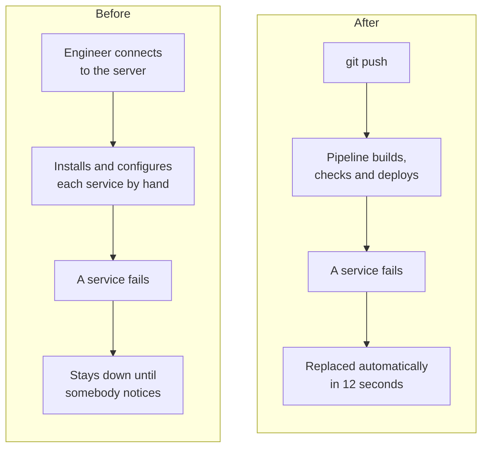
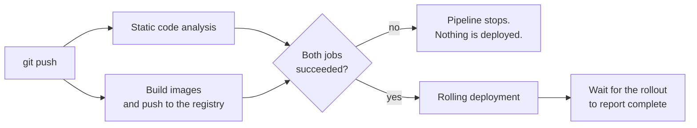

# Containerising the Reis™ KYC platform on Kubernetes

End-of-studies projectTest designWork

!!! note ""
    End-of-studies project for my Cloud Computing & DevOps engineering degree, carried out at
    Vneuron in 2026. I moved the Reis™ KYC platform off manual deployment and onto Kubernetes,
    with an automated delivery pipeline and a full observability stack, then validated the result
    against 16 requirements I had written first.

**Stack:** Docker · Kubernetes · GitHub Actions · Prometheus · Grafana · Loki

## The problem

Reis™ KYC ran as five services deployed by hand. A crashed service stayed down until somebody
noticed and went to the server. There was no rollback, no automated delivery, and no visibility
into what the platform was doing while it ran.

## What I did

I picked the orchestrator against documented criteria rather than by preference, comparing Docker
Compose, Docker Swarm, Kubernetes and HashiCorp Nomad on containerisation, autoscaling,
self-healing and pipeline support, and recording why each one won or lost.

Then I delivered it in four iterations, each with a written acceptance criterion I had to satisfy
before starting the next one:

1. Cluster and persistent storage ready
2. All five services running in containers
3. Delivery automated end to end
4. Metrics, logs and alert routing in place

The pipeline runs static analysis and the image build in parallel, then deploys only if both
succeed: under 14 minutes from a push to a running update, with no manual steps.

The gate matters more than the speed: a failed check cannot reach the running platform, because
the deployment job never starts.

## How I validated it

This is the part of the project I care most about. I wrote the requirements first, 9 functional
and 7 non-functional, gave every one of them a verification method, then ran one test per
requirement and recorded what actually happened:

| Category | Tests | Pass | Partial | Fail |
| --- | --- | --- | --- | --- |
| Functional | 9 | 7 | 2 | 0 |
| Non-functional | 7 | 7 | 0 | 0 |
| **Total** | **16** | **14** | **2** | **0** |

Each test carries an identifier, the requirement it traces back to, the exact procedure, the
expected result, the observed result, and a status.

??? example "Three of the sixteen tests"
    **Self-healing.** Procedure: delete a running application pod, then watch the pod list.
    Expected: a replacement reaches Running in under 120 seconds. Actual: replacement created
    immediately and Running in **12 seconds**. Pass.

    **Autoscaling under load.** Procedure: apply the autoscaler, run a stress workload calling the
    service continuously, and watch the autoscaler. Expected: replicas increase once CPU passes
    the 70% threshold. Actual: CPU reached **315%** of the configured request and the platform
    scaled from **1 replica to 5**. Pass.

    **Secrets hygiene.** Procedure: search the repository history for credential keywords, then
    list the credentials held by the cluster. Expected: nothing in plaintext anywhere in history.
    Actual: no matches in history; every credential held as a cluster secret. Pass.

The two partial results are reported as partial rather than rounded up to a pass: alert routing
was defined but no notification channel was connected, and the static-analysis gate ran in
warning mode instead of blocking the pipeline. Both are written up as the next hardening steps,
alongside automated load testing in the pipeline and immutable image tags.

!!! tip "Why this belongs on a QA portfolio"
    Before designing anything, I took the existing internal deployment guide and followed it step
    by step on a clean machine. The friction points that surfaced became inputs to the design.
    That is the same habit as everything else on this site: execute the documented steps, and
    treat whatever breaks as a finding.

    The health-check timings in the final setup were also derived from an observed failure rather
    than guessed, which is the difference between configuration that looks right and configuration
    that has been tested.

!!! warning "Confidentiality"
    Reis™ is Vneuron's proprietary compliance software. This page covers my own infrastructure and
    testing work only. It deliberately contains no product internals: no component names or
    versions, no addresses, ports or namespaces, no configuration, no code, and nothing about any
    client.

## What this shows

- :white_check_mark: Requirements written first, tested one by one, with partial results reported as partial
- :white_check_mark: Technology chosen against documented criteria, not preference
- :white_check_mark: Delivery in iterations, each gated by an acceptance criterion I had to meet
