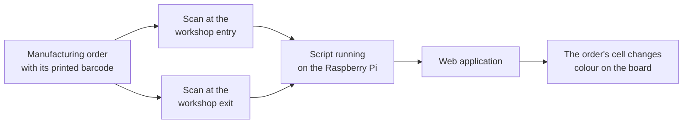

# Manufacturing-order tracking at SAFRAN

End-of-studies projectTest design

!!! note ""
    End-of-studies project for my Computer Engineering degree (SAFRAN, 2023), built by a
    two-person team: a web application that tracks manufacturing orders through the workshops in
    real time, fed by barcode scanning on the shop floor.

**Stack:** Angular · Spring · Raspberry Pi 4 · barcode scanners

## The problem

Manufacturing orders moved through the workshops with no live tracking, and a significant share
of them were missing their contracted start and end dates. Nobody could see where a given order
actually was without walking the floor and asking.

## What we built

A web application with three dashboards: work-in-progress tracking, production planning, and a
KPI view covering work in progress and on-time production, each computable per production unit
and per workshop.

The tracking came from the shop floor itself. Every order carries one barcode on its routing
sheet, and each workshop got a scan point at its entry and another at its exit: a handheld
scanner feeding a script on a Raspberry Pi, which updates the order's state in the application.
Order states are colour-coded on the board, so status is readable at a glance rather than looked
up.

The hardware was chosen the same way I would later choose an orchestrator: Raspberry Pi 4 and
Arduino Uno compared against processing power, flexibility and ease of use, with the reasoning
written down.

## Test design, before I knew that was what it was

Each of the eight core use cases was specified with an actor, a precondition, a postcondition, a
nominal scenario and an exception scenario. Reading them back now, they are test cases: every one
has a happy path and a named failure path, including duplicate records, missing data on import,
the wrong file format, empty required fields, a scan with no matching order, and a rejection at
quality control.

Validation ran in the real environment. We installed the scanning bench in an actual workshop and
had the production agents scan orders in and out themselves, with the scope deliberately narrowed
to orders passing through a single workshop so that one path could be verified end to end. Each
scan had exactly one predictable expected result, the order's state changing on the board, which
made every scan a pass or a fail.

!!! note "What I would do differently"
    The performance requirement said processing should be "as close to real time as possible",
    with no number attached, which makes it impossible to test. I would put a figure on it now.
    The specification also contradicted itself about whether one of the three roles needed to
    authenticate: one table said it did not, two others listed authentication as a precondition.
    That is exactly the kind of inconsistency I now catch in review, and finding it in my own
    older work is a fair measure of the distance covered.

## What this shows

- :white_check_mark: Specifications written with preconditions and exception paths, which are test cases in all but name
- :white_check_mark: Validation in real conditions, with the real users doing the work
- :white_check_mark: Hardware chosen against documented criteria, not preference
